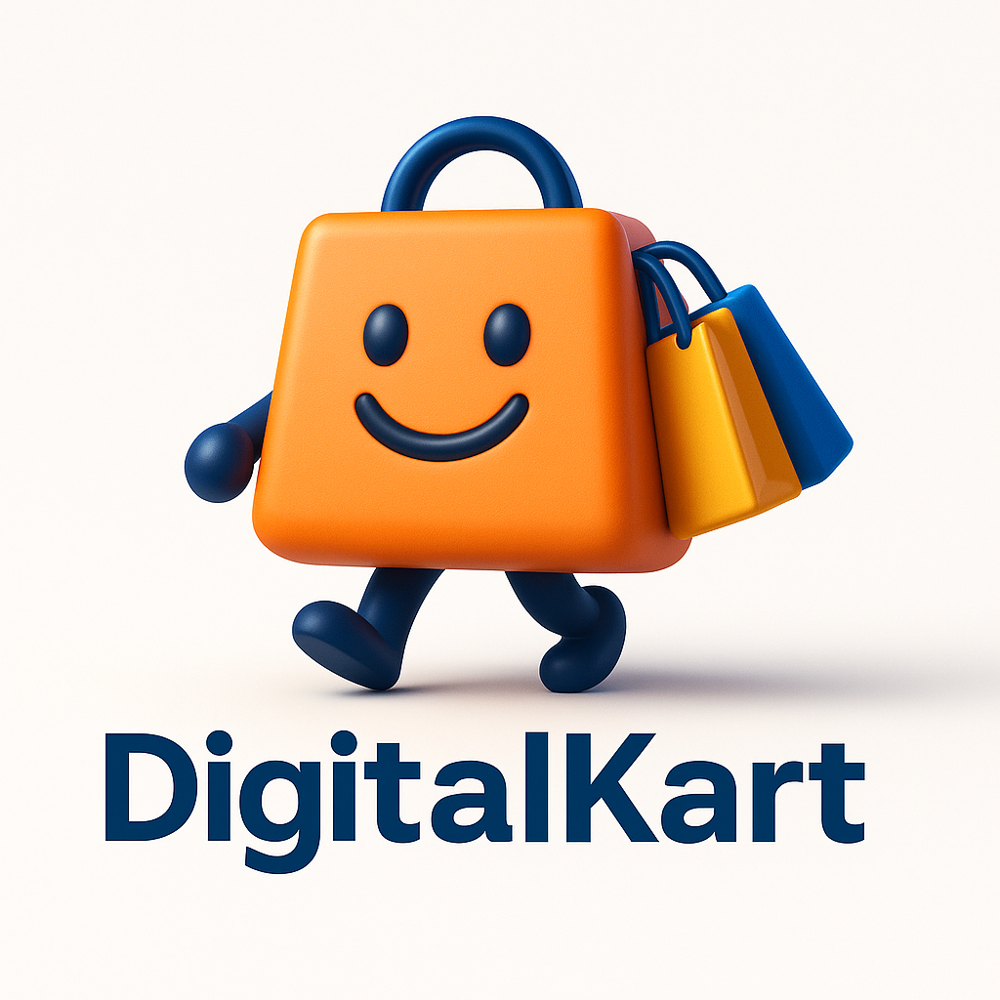

# Hi, I’m  Harshith 👋

---

## 👨‍💻 About Me
Hi, I’m Harshith 👋 – a **Full-Stack Developer** focused on **turning ideas into real-world web applications** using **Django, React, and Python**.  
- 🌱 I’m learning **AI & Machine Learning** to enhance my projects  
- 💬 Ask me about **Web Development, Full-Stack Projects, and AI**  
- 🎯 Passionate about building **efficient, scalable, and user-friendly applications**

---

## 🛠️ Technologies & Tools

---

## 📂 Projects

### 1️⃣ Digital Kart (Ecommerce Website)
  
- Full-stack project with **JWT authentication, Cart, Orders, and Payment Integration**  
- **Frontend:** React | **Backend:** Django REST Framework  

### 2️⃣ Fake News Detector
  
- Detects **fake news using Machine Learning algorithms**  
- **Tech:** Python, Scikit-learn, NLP  

---

## 📫 Connect with Me
  

---

### ⚡ Fun Fact
I love building projects that **solve real-world problems** and learning new technologies along the way! 🚀
